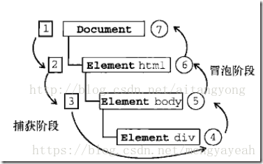

# JS第 3 周第 2 天

## 1. 事件流

> **事件的概念：**
>
> ​		HTML页面中与javascript交互是通过事件驱动来实现的，例如鼠标点击事件、页面的滚动事件onscroll等等，可以向文档或者文档中的元素添加事件侦听器（函数）来预订事件。想要知道这些事件是在什么时候进行调用的，就需要了解一下“事件流”的概念。

"DOM2事件流"规定的事件流包括三个阶段：

- 事件捕获阶段。

- 处于目标阶段。
- 事件冒泡阶段。

## 2. 事件委托

## 3.练习

- 自定义右键菜单
- 掌握事件监听的封装
- 弹出窗口拖拽
- 单元格交换

## 4. 小结

### 4.1. 事件对象

### 4.2. 常用鼠标事件

### 4.3. 常用的键盘事件

### 4.4. HTML事件

